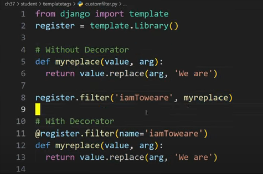
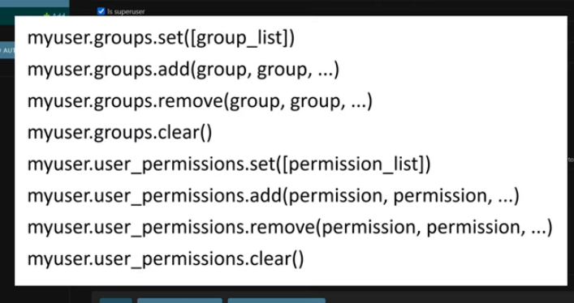
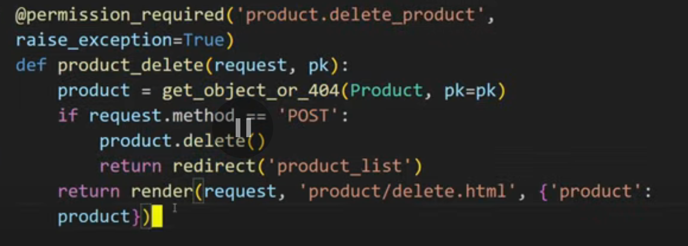
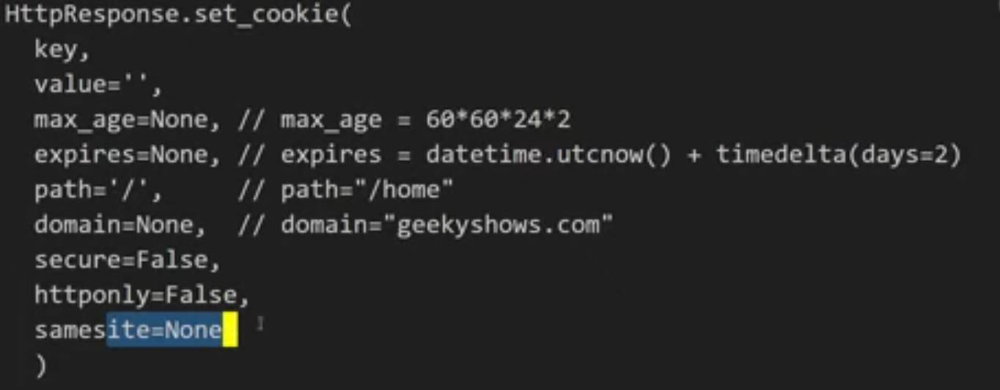
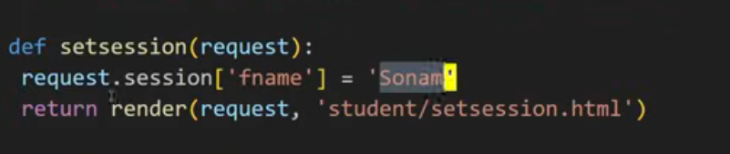
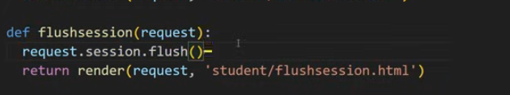

# day1

# Introduction to Django:-


It follows MVT architecture(Model View Template)


## Features and Advantage:-

- Built in Admin Interface
- ORM
- Authentication System
- Versality
- Security

# Django Prerequistie

- python 3.10 or Higher
- PIP
- Text Editor
- Web Browser

# How to Insstall Django????

- why use virtual Environment
  - Well the packages and libraries used in the project most of the times needed to be kept separate. With Venv we can keep them separated

---

Installation process:-
```cmd
python -m venv <Virtual env name>
```
Activation Process:-

```cmd
source ./<venv name>/bin/activate
```

and only then  You should download django

```cmd
pip install django
```

To check The downloaded libraries(only in python)
```cmd
pip freeze
```


# How to create django project:-

A django project may contain multiple project application, Which means a group of application and files is called as Django Project.
An application is a part of Django Project.


## How to start a project

```cmd
djang-admin startproject projectname
```

# Directory Structure:-
```
projectname/               ← Outer Project Directory
│
├── manage.py              ← Command-line utility for project management
│
└── projectname/           ← Inner Project Directory (same name as project)
    ├── __init__.py        ← Initializes this directory as a Python package
    ├── settings.py        ← Main configuration file
    │                        - Hosts, security settings, debug mode
    │                        - Installed apps
    │                        - Middleware
    │                        - Template and static directory settings
    ├── urls.py            ← Declares root-level URL routes
    ├── wsgi.py            ← WSGI entry point (for production servers)
    └── asgi.py            ← ASGI entry point (for async features)
```


# day2

# How to run Django Project on a specific port:-
<u>Default</u>
```cmd
python manage.py runserver
```

<u>To run it on a specific port:-</u>
```cmd
python manage.py runserver <port number>
```

---

# How to create django Applications
```cmd
django-admin startapp <appname>
```

## why do we even need applications in django?

1. Separation of Concerns
2. Reusability
3. Better Testing
4. Team collaboration
5. Pluggability

---

# Function Based View

- write functions in view.py
- add them in urls.py with the urls using path
- if we are creating multiple apps we have to use them with `as`

---
# URL PATTERN
- path function -> It needs url,view function, kwargs, name
- Best option ->
  - set urls.py in the separate apps and combine them in the project's url file


# Templates
- Django works on mvt(Model -> View -> Template) architecture
- we use render for it
- Best practice is to have them separately in each application

---

# Dynamic template
- here we can use jinja templates
- we have to sent a context (a dictionary)

---

# Django Template language

``` DTL is the default templating engine in Django.
 It's simple yet powerful, allowing HTML + Python-like logic inside templates.
 Alternatives like Jinja2 can be used, but require additional configuration.
```
- Basic Setup:
  - Django project and app creation (`startproject`, `startapp`).
  - Register the app in `INSTALLED_APPS` in `settings.py`.
  - Create a `templates` directory inside the app folder.
  - Structure: `app/templates/app_name/template.html`.

- Using Views with Templates:
  - Views use `render(request, template_name, context)` to pass data to templates.
  - Context is a dictionary of variables passed to the template.

- Variable Display in Templates:
  - Syntax: `{{ variable_name }}` to display variables.
  - You can pass complex dictionaries and access nested data.

- Filters in Templates:
  - Filters modify variable output. Examples:
    - `{{ name|lower }}` → lowercase
    - `{{ name|upper }}` → uppercase
    - `{{ name|truncatewords:3 }}` → limit to 3 words
    - `{{ name|length }}` → shows character count
    - `{{ name|default:"Guest" }}` → default value if variable is empty

- Date & Time Formatting:
  - Use `{{ date_var|date:"D d M Y" }}` for custom formats
  - Use `{{ time_var|time:"H:i" }}` for time
  - Built-in filters like `short_date_format` and `short_time_format` available.

- Float Formatting (Monetary/Precision Control):
  - Use `{{ price|floatformat:2 }}` to round to 2 decimal places
  - Supports positive, zero, and negative precision

- Conditionals: if, if-else, if-elif-else:
  - ...
  - ......
  - Support for and, or, not, and comparisons (==, !=, <, >)

# Template Inheritance
- Here we use it to redduce code redundancy
- to use tratic files we have to add  

# day3

# How to add bootstrap
1. Using CDN link
2. Using pip library  
   > Then you have to declare it in the `settings.py` as an installed app and in the `base.html` as ``

# How to use Tailwind CSS
~~We have to use node
There's also a pip library which we can use
Then we have to init it as an app
and declare it in settings.py~~ [old process]

1. First, set up a new folder.
2. Then run:
   ```bash
   npm install tailwindcss @tailwindcss/cli
   ```
3. Inside that folder, create a new CSS file and add:
   ```css
   @import "tailwindcss";
   ```
4. Finally, run:
   ```bash
   npx tailwindcss -i ./src/input.css -o ./src/output.css --watch
   ```
5. start using css in your html


# Hyperlink
In url.py we set names to urls. We use them to create hyperlinks in the frontend
The process is to use "" in the href


# ORM(Object Relational Manner)
it provides the interaction between the application and the database!
[alt text](image.png)
In django's orm it let's us write sql quaries in python

# model
A model in Django is a Python class that represents a database table.
It is the single, definitive source of information about your data.
It contains the essential fields and behaviors of the data you're storing.
Models define the structure of stored data, including field types, defaults, options, etc.
Each model maps to a single database table.

# retriving data from models
```python
val = Modelname.objects.all() # to get all
```

```python
val = Modelname.objects.get(seatsching_parameter = "something") # to get filtered
```

# Superuser
```cmd
python manage.py createsuperuser
```
> A Django superuser is a special kind of user account that has full administrative access to all parts of your Django project — especially the Django admin panel.

## Superuser Permissions:
- Can log into the admin panel (/admin/).
- Can view, add, edit, delete any model's data.
- Can create or manage other users (including staff and other superusers).
- Has all permissions by default, without needing to be explicitly assigned.


# day4

# Register class in Admin Panel
- Already did yesterday
# Customize model's look on admin panel

```python
from django.contrib import admin
from .models import Profile, Result
# Register your models here.
admin.site.register(Result)

class ProfileAdmin(admin.ModelAdmin):
    list_display = ('id','name', 'roll', 'email', 'city')
    search_fields = ('name', 'roll')
    list_filter = ('city',)

admin.site.register(Profile, ProfileAdmin)
```

# Form

```python
from django import forms
from .models import Profile, Result

class RegistrationForm(forms.Form):
    name = forms.CharField(max_length=100, required=True)
    roll = forms.IntegerField(required=True)
    email = forms.EmailField(required=True)
    city = forms.CharField(max_length=100, required=True)

    def save(self):
        profile = Profile(
            name=self.cleaned_data['name'],
            roll=self.cleaned_data['roll'],
            email=self.cleaned_data['email'],
            city=self.cleaned_data['city']
        )
        profile.save()
        return profile
```
we can also show them as 
    - `{{form.as_ul}}` for ul
    - `{{form.as_table}}` for table
    - `{{form.as_p}}` for in p
    - `{{form.<tag name>}}` for for specified input
  

# Custom form(Mannual One)
 Have done it before

# Form fields Types


# Built in validators
- ```python
    from django import forms
    from django.core import validators
    def check(value):
        if value[0]!='s':
            raise forms.ValidationError('Name should start with "s"')
    class Registration (forms.Form):
        name = forms.CharField(validators=[validators.
        MaxLengthValidator (10), validators.MinLength Validator()])
        email = forms. EmailField(validators =[check])
        password = forms.CharField(widget=forms.Password Input)
  ```
- 

# day5

## ✅ Django ModelForm Template

```python
from django import forms
from .models import <ModelName>

class RegistrationForm(forms.ModelForm):
    class Meta:
        model = <ModelName>
        fields = ['<field1>', '<field2>']  # List of field names

        labels = {
            '<field_name>': 'Label you want to display',
        }

        error_messages = {
            '<field_name>': {
                'required': 'This field is required.',
                'invalid': 'Enter a valid value.',
            }
        }

        widgets = {
            'name': forms.TextInput(attrs={
                'class': 'your-css-class',
                'placeholder': 'Your Placeholder'
            }),
        }
```

---

## 📌 Notes

* The **form fields' data types** are automatically inferred from the model fields.
* For special fields:

  * `ForeignKey` → `ModelChoiceField`
  * `ManyToManyField` → `ModelMultipleChoiceField`

---

## 🧬 Form Inheritance

You can inherit from an existing form like this:

```python
class NewForm(OldForm):
    # Add or override fields here
```

---

## 🔍 Filtering Querysets in Forms


```markdown
packagename/
├── __init__.py       # Declare it as a package
├── customfilter.py   # Your custom filters go here
```
> customfilter.py
```python
from django import templates
register =template.Libarry()
def myreplace(value,arg):
    return value.replace(arg ,'rplacing this word')
register.filter('customfiltername',myreplace)
```

```html
 # at the top of the file
{{data|customfiltername}}
```




## Dynamic Url


in the url file

```python
from django.urls import path
from . import views

urlpatterns = [
    path('dynamic/<int:pk>/', views.func_name, name='dynamic')
]
```

```python
from django.shortcuts import render

def func_name(request, pk):
    return render(request, 'htmlpage.html', {'pk_value': pk})
```


# Message

It is used at the time of debug and development
at the time of production it is removed

```python
from django.shortcuts import render
from django.contrib import messages
def home (request):
    messages.add_message(request,messages.SUCCESS,'your custom message')
    return render(request, 'student/home.html')

def registration (request):
    return render(request, 'student/registration.html')
```


> *#Disclaimer:-* Debug is usually set at level 10 and the default level is at 20 that's why it's doesn't show up at first
> That's why we have to set it by `messages.set_level(request,messages.DEBUG)`

 
>settings.py
We can have custom tags too
for css purposes


# day6

# Day 6 Django Project

## Overview
This project demonstrates user authentication and account management features using Django. Tailwind CSS is used for modern UI styling.

## Features Implemented
- User registration
- User login/logout
- Password reset and change functionality
- Authentication-based navigation (shows different menu items for logged-in/out users)
- Responsive layout using Tailwind CSS
- Organized Django app structure (`account` app)
- Custom base template for consistent site layout

## File Structure
- `account/` app: Handles user-related logic (models, views, forms, templates)
- `templates/base.html`: Main site template with navigation and content blocks
- `day6/settings.py`: Django settings for the project
- `manage.py`: Django management script
- `db.sqlite3`: SQLite database

## How to Run
1. Install dependencies from `requirements.txt`
2. Run migrations: `python manage.py migrate`
3. Start the server: `python manage.py runserver`

## Notes
- Navigation adapts based on authentication status
- Password management (reset/change) is available
- Tailwind CSS is loaded via CDN for styling

## Custom User Model & Manager
- Created a custom `User` model inheriting from `AbstractBaseUser` with fields for email, first/last name, and flags for staff/superuser/seller/customer.
- Implemented a custom `UserManager` to handle user and superuser creation, enforcing email uniqueness and password hashing.

## Authentication Processes
- **Registration:**
  - Used a custom `RegistrationForm` to collect user info and passwords.
  - On registration, user is created inactive and sent an activation email with a tokenized link.
- **Login:**
  - Used a custom `LoginForm` to validate credentials and authenticate users by email/password.
- **Change Password:**
  - Used a custom `ChangePasswordForm` to verify old password and set a new one.
- **Forgot Password:**
  - User submits email, receives a reset link with a token via email if the account exists.

## Email Activation & Password Reset
- Used Django's `urlsafe_base64_encode`/`decode` and `default_token_generator` to securely generate and verify activation/reset tokens.
- Sent emails asynchronously using a custom `send_async_email` utility (threaded, uses Django's `send_mail`).
- Activation and reset links include encoded user ID and token, which are decoded and verified in the respective views.

## Security & Decryption
- User ID is encoded with `urlsafe_base64_encode` and decoded with `urlsafe_base64_decode`.
- Token is generated and checked using Django's built-in token generator for secure activation/reset.
- All password changes and resets use Django's password hashing.

## Templates & Navigation
- Navigation adapts based on authentication status (login/register/forgot password for guests, change password/logout for users).
- All forms and flows are handled with custom templates for a clean UI.

## Example Code Snippets

### Custom User Model & Manager
```python
# models.py
from django.db import models
from django.contrib.auth.models import AbstractBaseUser, BaseUserManager

class UserManager(BaseUserManager):
    def create_user(self, email, password=None):
        if not email:
            raise ValueError('The Email field must be set')
        user = self.model(email=self.normalize_email(email))
        user.set_password(password)
        user.save(using=self._db)
        return user

    def create_superuser(self, email, password=None, **extra_fields):
        extra_fields.setdefault('is_staff', True)
        extra_fields.setdefault('is_superuser', True)
        user = self.create_user(email, password)
        user.is_staff = True
        user.is_superuser = True
        user.save(using=self._db)
        return user

class User(AbstractBaseUser):
    email = models.EmailField(unique=True)
    first_name = models.CharField(max_length=30, blank=True)
    last_name = models.CharField(max_length=30, blank=True)
    is_active = models.BooleanField(default=False)
    is_staff = models.BooleanField(default=False)
    is_superuser = models.BooleanField(default=False)
    objects = UserManager()
    USERNAME_FIELD = 'email'
```

### Registration & Activation
```python
# views.py
from django.utils.http import urlsafe_base64_encode, urlsafe_base64_decode
from django.utils.encoding import force_bytes, force_str
from django.contrib.auth.tokens import default_token_generator
from django.urls import reverse
from .utils import send_async_email

def register(request):
    # ...
    user = form.save(commit=False)
    user.set_password(form.cleaned_data['password1'])
    user.save()
    uidb64 = urlsafe_base64_encode(force_bytes(user.pk))
    token = default_token_generator.make_token(user)
    activation_link = reverse('activate', kwargs={'uidb64': uidb64, 'token': token})
    activation_url = f'{settings.SITE_DOMAIN}{activation_link}'
    send_async_email('Activate Your Account', f'Click: {activation_url}', user.email)
```

### Login
```python
# views.py
def login(request):
    # ...
    user = authenticate(email=email, password=password)
    if user is not None:
        auth_login(request, user)
        return redirect('home')
```

### Change Password
```python
# forms.py
class ChangePasswordForm(forms.Form):
    old_password = forms.CharField(widget=forms.PasswordInput)
    new_password1 = forms.CharField(widget=forms.PasswordInput)
    new_password2 = forms.CharField(widget=forms.PasswordInput)
    # ...
    def save(self, commit=True):
        self.user.set_password(self.cleaned_data['new_password1'])
        if commit:
            self.user.save()
        return self.user
```

### Forgot Password & Reset
```python
# views.py
def forgot_password(request):
    # ...
    user = User.objects.get(email=email)
    uidb64 = urlsafe_base64_encode(force_bytes(user.pk))
    token = default_token_generator.make_token(user)
    reset_link = reverse('reset_password', kwargs={'uidb64': uidb64, 'token': token})
    reset_url = f'{settings.SITE_DOMAIN}{reset_link}'
    send_async_email('Reset Your Password', f'Click: {reset_url}', user.email)
```

### Email Utility
```python
# utils.py
import threading
from django.core.mail import send_mail

def send_async_email(subject, message, to_email):
    threading.Thread(target=send_mail, args=(subject, message, None, [to_email])).start()
```

### Token Decryption
```python
# views.py
def activate(request, uidb64, token):
    uid = force_str(urlsafe_base64_decode(uidb64))
    user = User.objects.get(pk=uid)
    if default_token_generator.check_token(user, token):
        user.is_active = True
        user.save()
```

### Custom Permission

decoretors.py

```python
from django.contrib.auth.decorators import login_required
from functools import wraps
from django.http import HttpResponseForbidden


def login_required_custom(required_role):
    """Decorator to enforce login and role-based access control.
    Usage: @login_required_custom('customer') or @login_required_custom('seller')
    """
    def decorator(view_func):
        @login_required
        @wraps(view_func)
        def _wrapped_view(request, *args, **kwargs):
            user = request.user
            if required_role =="customer" and not user.is_customer:
                return HttpResponseForbidden("You do not have permission to access this page.")
            if required_role == "seller" and not user.is_seller:
                return HttpResponseForbidden("You do not have permission to access this page.")
            return view_func(request, *args, **kwargs)
        return _wrapped_view
```

### add Permissions to user


permissions.py

```python
from products.models import Product

PERMISSION_CONFIG = {
    'customer': {
        Product:["view"]
    },
    'seller': {
        Product:["view","add","change"]
    },
}
```

utils.py

```python
from django.contrib.auth.models import Permission
from django.contrib.contenttypes.models import ContentType
from products.models import Product

def assign_permissions(user, role):
    """Assign permissions to user based on their role."""
    content_type = ContentType.objects.get_for_model(Product)
    permissions = PERMISSION_CONFIG.get(role, {})
    
    for model, perms in permissions.items():
        for perm in perms:
            permission = Permission.objects.get(
                codename=f"{perm}_{model._meta.model_name}",
                content_type=content_type
            )
            user.user_permissions.add(permission)
```
```python
# views.py
from django.shortcuts import render, redirect
from django.contrib.auth.decorators import login_required
from .permissions import assign_permissions
from .models import User

def register(request):
    if request.method == 'POST':
        form = RegistrationForm(request.POST)
        if form.is_valid():
            user = form.save()
            role = form.cleaned_data['role']
            assign_permissions(user, role)  # Assign permissions based on role
            return redirect('login')
    else:
        form = RegistrationForm()
    return render(request, 'account/register.html', {'form': form})
```

```python
@login_required
def product_list(request):
    if request.user.has_perm('products.view_product'):
        products = Product.objects.all()
        return render(request, 'products/product_list.html', {'products': products})
    return HttpResponseForbidden("You do not have permission to view products.")
```


### COOKIE

A cookie is a small piece of data stored on the user's computer by a server. It’s used to remember information about the user across multiple requests or visits to the site.

we send it like this-> 

set-> 
get-> 
delete-> 

More secure->
signed cookies are more secure because they include a signature that verifies the integrity of the cookie data. This prevents tampering, as any changes to the cookie would invalidate the signature.


## Session Management
Django uses sessions to store data on the server side, allowing you to keep track of user interactions across requests. Sessions are typically stored in the database, cache, or file system.

> important settings.py
```python
# settings.py
INSTALLED_APPS = [
    ...
    'django.contrib.sessions',
    ...
]
MIDDLEWARE = [
    ...
    'django.contrib.sessions.middleware.SessionMiddleware',
    ...
]
```

SET->
get->
delete->
flush-> (used for clearing all session data/logout)

## Session Security
To enhance session security, you can configure settings like `SESSION_COOKIE_SECURE`, `SESSION_EXPIRE_AT_BROWSER_CLOSE`, and `SESSION_COOKIE_AGE` in your `settings.py` file. These settings help protect against session hijacking and ensure that sessions are only valid over secure connections.

```python
# settings.py
SESSION_COOKIE_SECURE = True  # Use secure cookies (HTTPS only)
SESSION_EXPIRE_AT_BROWSER_CLOSE = True  # Expire session when browser closes
SESSION_COOKIE_AGE = 1209600  # Session duration in seconds (2 weeks)
```

## Session in Files
Django can store session data in files by configuring the session engine in `settings.py`. This is useful for lightweight applications or when you want to avoid database overhead.
```python
# settings.py
SESSION_ENGINE = 'django.contrib.sessions.backends.file'
SESSION_FILE_PATH = BASE_DIR /'sessions'  # Specify the directory for session files
```
This will create session files in the specified directory, allowing you to manage session data without a database.


## Cache Management
Django provides a caching framework to store frequently accessed data in memory, reducing database queries and improving performance. You can use various backends like Memcached, Redis, or the local memory cache.
It helps in speeding up the application by storing data that is expensive to compute or retrieve.
### ✅ Django’s Caching Types :-

1. #### **Per-Site Caching** ✅

   * Caches **every page** for every user across the whole site.
   * Enabled via Django middleware (`UpdateCacheMiddleware` and `FetchFromCacheMiddleware`).
   * Good for public sites where the content is mostly static.
   * **Set in `settings.py`:**

    ```python
    MIDDLEWARE = [
        'django.middleware.cache.UpdateCacheMiddleware',
        ...
        'django.middleware.cache.FetchFromCacheMiddleware',
    ]

     

    CACHES = {
        'default': {
            'BACKEND': 'django.core.cache.backends.db.DatabaseCache',
            'LOCATION': 'django_cache',
            'TIMEOUT': 60 * 5,  # cache for 5 minutes
            'OPTIONS': {
                'MAX_ENTRIES': 1000,  # maximum number of entries in cache
            },
        }
    }
    # Local memory cache
    CACHES = {
        'default': {
            'BACKEND': 'django.core.cache.backends.locmem.LocMemCache',
            'LOCATION': 'unique-snowflake',
            'TIMEOUT': 60 * 5,  # cache for 5 minutes
        }
    }

    CACHE_MIDDLEWARE_SECONDS = 600  # cache for 10 minutes
    ```
    ```console
    python manage.py createcachetable  # create cache table in database
    ```


#### 2. **Per-View Caching**

- Caches the **entire output of a specific view**.
- More flexible than per-site caching.
- No middleware needed.
- Uses the `@cache_page` decorator.
- There are two ways to use it:

  **a. In the view function:**

  ```python
  from django.views.decorators.cache import cache_page

  @cache_page(60 * 5)
  def my_view(request):
      ...


**b. In the URL configuration:**

```python
# urls.py
from django.urls import path
from .views import my_view
from django.views.decorators.cache import cache_page

urlpatterns = [
    path('my-view/', cache_page(60 * 5)(my_view), name='my_view'),
]
```


3. #### **Template Fragment Caching**

   * Caches **sections of templates**.
   * Useful when only parts of a page are slow.
   * Syntax:

     ```django
     
     
         ... expensive HTML block ...
     
     ```

4. #### **Low-Level Caching**

   * Caches **arbitrary Python data** (querysets, computations, etc.)
   * Uses the `django.core.cache` API:

     ```python
     from django.core.cache import cache

     result = cache.get("expensive_query")
     if result is None:
         result = do_expensive_thing()
         cache.set("expensive_query", result, timeout=300)
     cache.add("new_key", "value", timeout=300)  # Adds only if key doesn't exist
     cache.delete("old_key")  # Deletes a key from cache
     cache.clear()  # Clears the entire cache
     cache.set_many({"key1": "value1", "key2": "value2"}, timeout=300)  # Set multiple keys at once
     cache.get_many(["key1", "key2"])  # Get multiple keys at once
     cache.touch("key", timeout=600)  # Update timeout of an existing key
     cache.incr("counter")  # Increment a numeric value in cache
     cache.decr("counter")  # Decrement a numeric value in cache
     ```

---

### ✅ Final Summary

| Type                  | Scope                   | Example Use Case                       |
| --------------------- | ----------------------- | -------------------------------------- |
| **Per-Site Caching**  | Entire site (all pages) | Blog or CMS with same content for all  |
| **Per-View Caching**  | One view function/class | Product listing or home page           |
| **Template Fragment** | Part of a template      | Sidebar, footer, or tag cloud          |
| **Low-Level Caching** | Arbitrary data          | Querysets, computations, external APIs |

---

It has 3 places to store cache:
1. **Database**: Stores cache data in the database tables.
   - Use `django.core.cache.backends.db.DatabaseCache`.
   - Requires `django.contrib.sessions` app.
   - Create cache table with `python manage.py createcachetable`.
2. **File System**: Stores cache data in files on the server.
   - Use `django.core.cache.backends.filebased.FileBasedCache`.
   - Specify directory in `settings.py` with `FILE_CACHE_DIR`.
3. **Memory**: Stores cache data in memory (RAM).
   - Use `django.core.cache.backends.locmem.LocMemCache`.
   - Fastest but data is lost on server restart.


# day7

# Signals

In Django, signals are a way to allow certain senders to notify a set of receivers when some action has taken place.

It has many types of signals. They are ->
## Model Signals
- `pre_save`: Sent just before a model's `save()` method is called.
- `post_save`: Sent just after a model's `save()` method is called.
- `pre_delete`: Sent just before a model's `delete()` method is called.
- `post_delete`: Sent just after a model's `delete()` method is called.
- `pre_init`: Sent just before a model's `__init__()` method is called.
- `post_init`: Sent just after a model's `__init__()` method is called.
- `class_prepared`: Sent when a model class is prepared.

## DB Signals
- `connection_created`: Sent when a new database connection is created.
- `connection_closed`: Sent when a database connection is closed.
## Request/Response Signals
- `request_started`: Sent when a request is started.
- `request_finished`: Sent when a request is finished.
- `got_request_exception`: Sent when an exception is raised during request processing.
## User Signals
- `user_logged_in`: Sent when a user logs in.
- `user_logged_out`: Sent when a user logs out.
- `user_password_changed`: Sent when a user changes their password.
- `user_login_failed`: Sent when a user login attempt fails.
## Migration Signals
- `pre_migrate`: Sent before a migration is applied.
- `post_migrate`: Sent after a migration is applied.
## Settings Signals
- `setting_changed`: Sent when a setting is changed.
- `template_rendered`: Sent when a template is rendered.
## Many-to-Many Signals
- `m2m_changed`: Sent when a many-to-many relationship is changed.
## Custom Signals
- You can create custom signals using Django's `Signal` class.


## User Signals Example
Let's see how to use user signals 

```python
# signals.py
from django.contrib.auth.models import User
from django.contrib.auth.signals import user_logged_in, user_logged_out, user_login_failed


def login_success(sender,request, user, **kwargs):
    print(f"User {user.username} logged in successfully.")


user_logged_in.connect(login_success,sender=User)

```
we can also use decorators to connect signals:
```python
# signals.py
... #same headers as above
from django.dispatch import receiver

@receiver(user_logged_in, sender=User)
def login_success(sender, request, user, **kwargs):
    print(f"User {user.username} logged in successfully.")
```
> same work flow with user_logged_out, user_login_failed, etc.

## Model Signals Example
Let's see how to use model signals

```python
# signals.py
from django.db.models.signals import pre_save, post_save,pre_delete, post_delete,pre_init, post_init, class_prepared,pre_migrate, post_migrate
from django.dispatch import receiver

@receiver(pre_save, sender=MyModel)
def my_model_pre_save(sender, instance, **kwargs):
    print(f"About to save {instance} of type {sender.__name__}")

@receiver(post_save, sender=MyModel)
def my_model_post_save(sender, instance, created, **kwargs):
    if created:
        print(f"Created new {instance} of type {sender.__name__}")
    else:
        print(f"Updated {instance} of type {sender.__name__}")

@receiver(pre_delete, sender=MyModel)
def my_model_pre_delete(sender, instance, **kwargs):
    print(f"About to delete {instance} of type {sender.__name__}")

@receiver(post_delete, sender=MyModel)
def my_model_post_delete(sender, instance, **kwargs):
    print(f"Deleted {instance} of type {sender.__name__}")

@receiver(pre_init, sender=MyModel)
def my_model_pre_init(sender, *args, **kwargs):
    print(f"About to initialize {sender.__name__}")

@receiver(post_init, sender=MyModel)
def my_model_post_init(sender, instance, **kwargs):
    print(f"Initialized {instance} of type {sender.__name__}")

@receiver(class_prepared, sender=MyModel)
def my_model_class_prepared(sender, **kwargs):
    print(f"Class {sender.__name__} is prepared")

@receiver(pre_migrate)
def my_model_pre_migrate(sender, **kwargs):
    print("About to apply migrations")

@receiver(post_migrate)
def my_model_post_migrate(sender, **kwargs):
    print("Migrations applied successfully")
```

## Request Signals Example
Let's see how to use request signals

```python
# signals.py
from django.core.signals import request_started, request_finished, got_request_exception
from django.dispatch import receiver

@receiver(request_started)
def request_started_handler(sender, **kwargs):
    print("Request has started")

@receiver(request_finished)
def request_finished_handler(sender, **kwargs):
    print("Request has finished")

@receiver(got_request_exception)
def got_request_exception_handler(sender, request, **kwargs):
    print(f"An exception occurred during request processing: {kwargs.get('exception')}")
```

## DB Signals Example
Let's see how to use DB signals
```python
# signals.py
from django.db.backends.signals import connection_created

from django.dispatch import receiver
@receiver(connection_created)
def connection_created_handler(sender, connection, **kwargs):
    print(f"New database connection created: {connection.alias}")
```


## Custom Signals Example
You can create custom signals using Django's `Signal` class.

```python
# signals.py
from django.dispatch import Signal, receiver

# Define a custom signal

notification_sent = Signal()

@receiver(notification_sent)
def send_notification(sender, **kwargs):
    # Logic to send notification
    print("Notification sent!")
    print(f"Sender: {sender}, kwargs: {kwargs}")
```
```python
# views.py
from myapp.signals import notification_sent
def some_view(request):
    # Some logic
    notification_sent.send(sender=request.user, message="Hello, World!")
```

## How to Register Signals

```python
# apps.py
from django.apps import AppConfig
class MyAppConfig(AppConfig):
    name = 'myapp'

    def ready(self):
        import myapp.signals  # Import the signals module to ensure signals are registered
```


```python
# __init__.py
default_app_config = 'myapp.apps.MyAppConfig'
```
if u do not want to use __init__.py, you can add the app config directly in the settings.py file:

```python
# settings.py
INSTALLED_APPS = [
    ...
    'myapp.apps.MyAppConfig',  # in place of 'myapp'
    ...
]
```


## Caution
- Signals are great for decoupling logic (e.g., don't clutter your views),

- But overusing signals can make your codebase hard to debug and hard to follow, since logic is triggered “in the background.”

### uses of signals
Signals are triggered when specific actions/events happen, especially in the models/auth layer. They're perfect for adding side effects without cluttering your main code.

1. Send Emails or Notifications
    Send a welcome email when a user registers (post_save on User).

    Alert admin when an important model is updated.

```python
@receiver(post_save, sender=User)
def welcome_email(sender, instance, created, **kwargs):
    if created:
        send_mail("Welcome!", "Thanks for joining.", to=[instance.email])
```
👥 2. Auto-create Related Models
    Automatically create a Profile when a new User is created.

```python
@receiver(post_save, sender=User)
def create_user_profile(sender, instance, created, **kwargs):
    if created:
        Profile.objects.create(user=instance)
```
3. Clean Up Data
    When an object is deleted (post_delete), remove associated files or records.

4. Auth Tracking
    Log user login/logout events.

    Trigger actions when login fails.

```python
@receiver(user_logged_in)
def track_login(sender, user, request, **kwargs):
    print(f"{user.username} just logged in")
```
5. Testing & Development
    Mock or track actions during automated tests.

    Reset data when migrations are run (post_migrate).


# Middlewares
Middlewares are a way to process requests globally before they reach the view or after the view has processed them. They can be used for various purposes such as logging, authentication, and more.

> Middleware works for all requests, not just specific ones. It is applied to every request that comes into the Django application.(Womp womp😭)

```markdown
| Feature          | **Middleware**                                   |
| ---------------- | ------------------------------------------------ |
| **Layer**        | HTTP Request/Response cycle                      |
| **Trigger**      | Every request/response                           |
| **Scope**        | Global (affects all views/requests)              |
| **Manual Call?** | Never called manually (auto-applied by Django)   |
| **Best For**     | Security, logging, request/response modification |

| Feature          | **Signals**                                              |
| ---------------- |
| **Layer**        | Model or App event layer (database, login, etc.)         |
| **Trigger**      | Specific events like `post_save`, `user_logged_in`, etc. |
| **Scope**        | Local to models or specific actions                      |
| **Manual Call?** | Also automatic, but must be explicitly connected         |
| **Best For**     | Side effects: emails, logging, cleanup, notifications    |


| Role                  | Middleware                        | Signals                                                    |
| --------------------- | --------------------------------- | ---------------------------------------------------------- |
| Like a **toll booth** | Checks/modifies **every request** | Like a **doorbell** — only rings when an **event happens** |
```

## functional middleware example

```python 
# middlewares.py
def my_fun_middleware(get_response):
    print("One-time configuration or initialization.")
    def middleware(request):
        # Code to be executed for each request before the view (and later middleware) are called.
        print("Before the view")

        response = get_response(request)

        # Code to be executed for each request/response after the view is called.
        print("After the view")
        
        return response

    return middleware
```

```python
# settings.py
MIDDLEWARE = [
    ...
    'myapp.middlewares.my_fun_middleware',  # Add your middleware here
    ...
]
```
We can also use it for rendering templates, for example:
```python
# middlewares.py
from django.shortcuts import render
def template_rendering_middleware(get_response):
    def middleware(request):
        response = get_response(request)
        
        if response.status_code == 200 and 'text/html' in response['Content-Type']:
            # Render a template for the response
            return render(request, 'my_template.html', context={'data': 'Hello, World!'})
        
        return response

    return middleware
```
in this case, the logic in views.py will not be executed, and the template will be rendered directly from the middleware.

## Class-based middleware example

```python
# middlewares.py
class MyMiddleware:
    def __init__(self, get_response):
        self.get_response = get_response
        print("One-time configuration or initialization.")

    def __call__(self, request):
        # Code to be executed for each request before the view (and later middleware) are called.
        print("Before the view")

        response = self.get_response(request)

        # Code to be executed for each request/response after the view is called.
        print("After the view")
        
        return response
    def process_view(self, request, view_func, view_args, view_kwargs):
        # Code to be executed before the view is called.
        print("Processing view")
        return None  # Return None to continue processing the view
    def process_exception(self, request, exception):
        # Code to handle exceptions raised by the view.
        print(f"Exception occurred: {exception}")
        return None  # Return None to continue processing the exception
    def process_template_response(self, request, response):
        # Code to modify the response before rendering the template.
        print("Processing template response")
        response.context_data['additional_data'] = 'Some additional data'
        return response  # Return the modified response
```

```python
# settings.py
MIDDLEWARE = [
    ...
    'myapp.middlewares.MyMiddleware',  # Add your middleware here
    ...
]
```
### Uses of Middleware
Middleware sits between the request and the view, and between the view and the response. It’s ideal for things that apply to every request or every response.

1. Security
Block users from specific IPs or user agents.

Enforce HTTPS (redirect HTTP to HTTPS).

Add security headers (like X-Frame-Options, Content-Security-Policy).

```python
class BlockIPMiddleware:
    def __call__(self, request):
        if request.META['REMOTE_ADDR'] in ['192.168.1.1']:
            return HttpResponseForbidden("Blocked")
```
2. Logging & Debugging
    Log every incoming request and outgoing response.

    Track performance or API usage stats.

3. Request/Response Modification
    Automatically add headers or cookies.

    Attach metadata or custom attributes to the request before it hits your view.

4. Session & Authentication
    Custom middleware for session-based access control.

    Inject user data globally into all views.

> The order of middleware matters! Django processes them in the order they are listed in `MIDDLEWARE` setting. If one middleware modifies the request, the next one will see that modification.

The oder is like this:
```markdown
Middleware1(init) -> Middleware2(init) -> Middleware1(call) -> Middleware2(call) -> View -> Middleware2(response) -> Middleware1(response)
```

Although you can still make it accessable to speciied users only, by checking the request.user in the middleware:
```python
# middlewares.py
from django.http import HttpResponseForbidden
class UserSpecificMiddleware:
    def __call__(self, request):
        if request.user.is_staff:
            return self.get_response(request)
        else:
            return render(request, 'not_allowed.html')
```
We can also use some restricted key by which anyone can access the site like this:
```python
# middlewares.py
from django.http import HttpResponseForbidden
from django.conf import settings
class RestrictedAccessMiddleware:
    def __call__(self, request):
        unk = "key" # replace with your key
        if 'u' in request.GET and request.GET['u'] == unk:
            return self.get_response(request)
        else:
            return render(request, 'not_allowed.html')
```
The user can access the site by using the key like this:
```http://example.com/?u=key```


# QuerySet

get all:- Modelname.objects.all()
all data but filtered :- ModelName.objects.filter(field=value)
get one object:- ModelName.objects.get(field=value)
get one object or return None:- ModelName.objects.filter(field=value).first()
exclude :- ModelName.objects.exclude(field=value)
count :- ModelName.objects.count()
order by :- ModelName.objects.order_by('field') # ascending
order by descending :- ModelName.objects.order_by('-field')
random :- ModelName.objects.order_by('?')
distinct :- ModelName.objects.distinct()
upto some number of objects :- ModelName.objects.order_by('field')[:10]
to get only some fields :- ModelName.objects.values('field1', 'field2')

to see the SQL query generated by a queryset, you can use the `query` attribute:

```python
queryset = ModelName.objects.filter(field=value)
print(queryset.query)
```


union of two querysets:
```python
queryset1 = ModelName.objects.filter(field1=value1)
queryset2 = ModelName.objects.filter(field2=value2)
combined_queryset = queryset1.union(queryset2)
# to allow duplicates
combined_queryset = queryset1.union(queryset2, all=True)
```
intersection of two querysets:
```python
queryset1 = ModelName.objects.filter(field1=value1) 
queryset2 = ModelName.objects.filter(field2=value2)
intersection_queryset = queryset1.intersection(queryset2)
```
difference of two querysets:
```python
queryset1 = ModelName.objects.filter(field1=value1)
queryset2 = ModelName.objects.filter(field2=value2)
difference_queryset = queryset1.difference(queryset2)
```

`And` and `Or` operations:
```python
# AND operation
queryset = ModelName.objects.filter(field1=value1) & ModelName.objects.filter(field2=value2)
queryset = ModelName.objects.filter(field1=value1,field2=value2)

# OR operation
queryset = ModelName.objects.filter(field1=value1) | ModelName.objects.filter(field2=value2)
```

>get might get multiple objects if the filter is not unique, causing an error, so use it with caution.

first and last:
```python
first_object = ModelName.objects.first()  # Get the first object
last_object = ModelName.objects.last()    # Get the last object
```

we can also do it with other querysets:
```python
first_object = ModelName.objects.filter(field=value).first()  # Get the first object matching the filter
object_2 = ModelName.objects.order_by('field').last()  # Get the last object ordered by 'field'
```
**latest**
```python
latest_object = ModelName.objects.latest('pass_date')
```
> **Note:** `latest()` requires a field to order by, typically a date or timestamp field. in this case, it is `pass_date`. the model must have a field somthing like this`pass_date = models.DateTimeField(auto_now_add=True)`

**earliest**
```python
earliest_object = ModelName.objects.earliest('pass_date')
```
> **Note:** `earliest()` also requires a field to order by, similar to `latest()`. it is `pass_date` in this case.

**Create Data**
```python
# Create a new object
new_object = ModelName.objects.create(field1=value1, field2=value2)
```
> This will create a new object in the database and return the created object.

**get_or_create**
```python
# Get an object if it exists, otherwise create it
obj, created = ModelName.objects.get_or_create(field1=value1, defaults={'field2': value2})
```
> `get_or_create` returns a tuple of the object and a boolean indicating whether it was created or not. The `defaults` argument allows you to specify additional fields to set if the object is created.

**update**
```python
# Update existing objects
ModelName.objects.filter(field1=value1).update(field2=value2)
```
> This will update all objects matching the filter with the new value for `field2`.

**bulk_create**
```python
# Bulk create multiple objects
objects_to_create = [
    ModelName(field1=value1, field2=value2),
    ModelName(field1=value3, field2=value4),
]
ModelName.objects.bulk_create(objects_to_create)
```
> `bulk_create` allows you to create multiple objects in a single query, which is more efficient than creating them one by one.


## Field lookups
Django provides a powerful way to filter querysets using field lookups. These lookups allow you to perform various types of queries on your models. Here are some common field lookups:
- exact: Matches the exact value.
```python
ModelName.objects.filter(field__exact=value)
```
- iexact: Case-insensitive exact match.
```python
ModelName.objects.filter(field__iexact=value)
```
- contains: Checks if the field contains the specified value.
```python
ModelName.objects.filter(field__contains=value)
```
- icontains: Case-insensitive contains check.
```python
ModelName.objects.filter(field__icontains=value)
```
- in: Checks if the field's value is in a list of values.
```python
ModelName.objects.filter(field__in=[value1, value2, value3])
```
- gt: Greater than.
```python
ModelName.objects.filter(field__gt=value)
```
- gte: Greater than or equal to.
```python
ModelName.objects.filter(field__gte=value)
```
- lt: Less than.
```python
ModelName.objects.filter(field__lt=value)
```
- lte: Less than or equal to.
```python
ModelName.objects.filter(field__lte=value)
```
- startswith: Checks if the field starts with the specified value.
```python
ModelName.objects.filter(field__startswith=value)
```
- istartswith: Case-insensitive startswith check.
```python
ModelName.objects.filter(field__istartswith=value)
```
- endswith: Checks if the field ends with the specified value.
```python
ModelName.objects.filter(field__endswith=value)
```
- iendswith: Case-insensitive endswith check.
```python
ModelName.objects.filter(field__iendswith=value)
```
- range: Checks if the field's value is within a specified range.
```python
ModelName.objects.filter(field__range=(start_value, end_value))
```
- isnull: Checks if the field is null.
```python
ModelName.objects.filter(field__isnull=True)  # or False
```

- date: Filters by date.
```python
ModelName.objects.filter(field__date=date_value)
```
- year: Filters by year.
```python
ModelName.objects.filter(field__year=year_value)
ModelName.objects.filter(field__year__gt=year_value)  # greater than
```
- month: Filters by month.
```python
ModelName.objects.filter(field__month=month_value)
```

# Aggregate Functions


- Avg: Calculates the average of a field.
```python
from django.db.models import Avg

data = ModelName.objects.all()
average = data.aggregate(Avg('field'))
```
- Count: Counts the number of objects.
```python
from django.db.models import Count
data = ModelName.objects.all()
count = data.aggregate(Count('field'))
```
- Max: Finds the maximum value of a field.
```python
from django.db.models import Max
data = ModelName.objects.all()
max_value = data.aggregate(Max('field'))
```
- Min: Finds the minimum value of a field.
```python
from django.db.models import Min
data = ModelName.objects.all()
min_value = data.aggregate(Min('field'))
```
- Sum: Calculates the sum of a field.
```python
from django.db.models import Sum
data = ModelName.objects.all()
total = data.aggregate(Sum('field'))
```

# Q Objects
```python
from django.db.models import Q

students = Student.objects.filter(
    Q(name__icontains='john') | Q(age__gte=18)
)
```
> This will return all students whose name contains 'john' or whose age is greater than or equal to 18.
> You can also use `&` for AND operations and `~` for NOT operations:
```python
students = Student.objects.filter(
    Q(name__icontains='john') & ~Q(age__lt=18)
)
```
> This will return all students whose name contains 'john' and whose age is not less than 18.
```python
from django.db.models import Q
students = Student.objects.filter(
    ~Q(id__in=[1, 2, 3]) & Q(name__icontains='john')
)
```
> This will return all students whose name contains 'john' and whose id is not in the list [1, 2, 3].


# day8

# Model Inheritance

This example demonstrates how to use model inheritance in Django. Model inheritance allows you to create a base model that can be extended by other models, enabling code reuse and a cleaner design.


## Abstract Base Classes
Abstract base classes are used when you want to define common fields and methods that can be inherited by other models, but you do not want to create a database table for the base class itself. Instead, only the child classes will have their own database tables.
```python
# models.py
from django.db import models
# Model Inheritance Example
class BaseModel(models.Model):
    name = models.CharField(max_length=100)
    age = models.IntegerField()
    joined_date = models.DateField()
    class Meta:
        abstract = True
    
class Student(BaseModel):
    fees = models.DecimalField(max_digits=10, decimal_places=2)
    joined_date = None  # Overriding the joined_date field to None
class Teacher(BaseModel):
    salary = models.DecimalField(max_digits=10, decimal_places=2)
class Contractor(models.Model):
    payment = models.DecimalField(max_digits=10, decimal_places=2)
```

## Multi-table Inheritance
Multi-table inheritance is used when you want to create a base model that has its own database table, and each child model will also have its own table that includes a foreign key to the base model. This allows you to query the base model and get all related child models.

```python
# models.py
from django.db import models
# Model Inheritance Example
class ExamCenter(models.Model):
    center_name = models.CharField(max_length=100)
    center_city = models.CharField(max_length=100)

class Student(ExamCenter):
    name = models.CharField(max_length=100)
    roll_number = models.CharField(max_length=20)
```

## Proxy Models
Proxy models are used when you want to change the behavior of a model without changing its fields or its database table. This is useful for adding custom methods or changing the default ordering of a model.

```python
# models.py
from django.db import models
# Model Inheritance Example
class BaseModel(models.Model):
    name = models.CharField(max_length=100)

class Student(BaseModel):
    class Meta:
        proxy = True
        ordering = ['name']
```

# Model Manager
In Django, a model manager is a class that manages database query operations for a model. It provides methods to retrieve and manipulate data in the database. You can create custom managers to add specific query methods that are not provided by the default manager.
```python
# managers.py
from django.db import models
# Custom Manager Example
class CustomManager(models.Manager):
    def get_queryset(self):
        return super().get_queryset().filter(is_active=True)  # Example filter for active records
    def custom_method(self):
        return self.get_queryset().filter(is_active=True)  # Custom method to filter active records
```

```python
# models.py
from django.db import models
from .managers import CustomManager
# Model Manager Example
class Student(models.Model):
    name = models.CharField(max_length=100)
    active = models.BooleanField(default=True)
    objects = CustomManager()
    custom_objects = models.Manager()  # Default manager
```
## Usage
To use the custom manager in your views or other parts of your application, you can call the custom methods defined in the manager. For example:
```python
# views.py
from django.shortcuts import render
from .models import Student
def student_list(request):
    students = Student.objects.custom_method()
    return render(request, 'student_list.html', {'students': students})
def student_active_list(request):
    active_students = Student.custom_objects.filter(is_active=True)
    return render(request, 'active_student_list.html', {'students': active_students})
```

# Model Relationships
Django provides several types of relationships between models, allowing you to define how models are related to each other. The most common types of relationships are:
- One-to-One
- Many-to-One
- Many-to-Many

## One-to-One Relationship
A one-to-one relationship is used when you want to create a unique link between two models.
This is useful for extending a model with additional fields without creating a separate table.
```python
# models.py
from django.db import models
# One-to-One Relationship Example
class User(models.Model):
    username = models.CharField(max_length=100)

class Profile(models.Model):
    user = models.OneToOneField(User, on_delete=models.CASCADE,primary_key=True)
    bio = models.TextField()
    location = models.CharField(max_length=100)
```
> So here, the `Profile` model has a one-to-one relationship with the `User` model, meaning each user can have only one profile and each profile belongs to only one user. So if anything happens(as mentioned ``DELETE``) to `User` object related to `profile` The profile one will also change. but if anything happens with the profile it will not happen in the user.

The behavioural options are ->
- Cascade(will delete both if we try to delete the user)
  - limit_choices_to -> 'is_staff': True (will let further option)
- Protect( Will not let delete if we try to delete the user who has relations with profile)
- Do_Nothing -> literally do nothing, let it happen(*Tame Impala*) well it will cause error if we do not describe any default behaviour

## Many-to-One Relationship
A many-to-one relationship is used when you want to create a link between two models where one model can be related to multiple instances of another model. This is typically done using a foreign key.
```python
# models.py
from django.db import models
# Many-to-One Relationship Example
class Author(models.Model):
    name = models.CharField(max_length=100)

class Book(models.Model):
    title = models.CharField(max_length=100)
    author = models.ForeignKey(Author, on_delete=models.CASCADE, related_name='books')
```

> In this example, the `Book` model has a foreign key to the `Author` model, meaning each book can have only one author, but an author can have multiple books. The `related_name` attribute allows you to access the related books from the author instance.
It has same behavioural options as mentioned above in the one-to-one relationship.

## Many-to-Many Relationship
A many-to-many relationship is used when you want to create a link between two models where each model can be related to multiple instances of the other model. This is typically done using a many-to-many field.
```python
# models.py
from django.db import models
# Many-to-Many Relationship Example
class Student(models.Model):
    name = models.CharField(max_length=100)

class Course(models.Model):
    name = models.CharField(max_length=100)
    students = models.ManyToManyField(Student, related_name='courses')
```
> here related name allows you to access the related courses from the student instance. Without it, you would have to use the default related name which is `course_set` for the `Course` model.
```python
# Usage Example
student = Student.objects.get(id=1)
courses = student.courses.all()  # Accessing related courses from the student instance
```

# Context Processors
Context processors are functions that take a request object and return a dictionary of context data that will be added to the context of every template rendered with the request. They are used to make certain data available globally in templates without having to pass it explicitly in every view.
```python
# context_processors.py
def cart_items(request):
    cart_items = request.session.get('cart_items', 0)  # Example: Get cart items from session
    return {'cart_items': cart_items}  # Return a dictionary with the context data
```

```python
# settings.py
TEMPLATES = [
    {
        'BACKEND': 'django.template.backends.django.DjangoTemplates',
        'DIRS': [],
        'APP_DIRS': True,
        'OPTIONS': {
            'context_processors': [
                'django.template.context_processors.debug',
                'django.template.context_processors.request',
                'django.contrib.auth.context_processors.auth',
                'django.contrib.messages.context_processors.messages',
                # Add your custom context processor here
                'yourapp.context_processors.cart_items',
            ],
        },
    },
]
```
```python
# views.py
from django.shortcuts import render
def home(request):
    return render(request, 'home.html')  # The context processor will automatically add 'cart_items' to the context
```
````
| Use case                               | Why use a context processor?                 |
| -------------------------------------- | -------------------------------------------- |
| 🛒 Cart item count (like your example) | Show cart count in navbar on every page      |
| 👤 Logged-in user profile info         | Display user's name or avatar in header      |
| 🌐 Current site settings               | Site name, footer copyright, etc.            |
| 🔔 Global messages/notifications       | Unread notifications in nav                  |
| 📊 App-wide stats                      | Number of active users, trending posts, etc. |
| 🎨 Theme/branding settings             | Dynamic colors, layout mode                  |
| 🌍 Language or timezone                | For internationalization                     |
````

# Asgi server
ASGI (Asynchronous Server Gateway Interface) is a specification that allows for asynchronous communication between web servers and web applications. It is designed to handle asynchronous protocols like WebSockets, HTTP/2, and HTTP/3, making it suitable for modern web applications that require real-time communication.

## Configuring ASGI in Django
### Daphne
```bash
pip install daphne
```
run the following command to start the ASGI server:
```bash
daphne -p 8000 myproject.asgi:application
```
to run it by runserver command
```python
#settings.py
INSTALLED_APPS = [
    'daphne',
    ...
    
]
...
ASGI_APPLICATION = 'myproject.asgi.application'
```

```bash
python manage.py runserver --asgi
```
### Uvicorn
```bash
pip install uvicorn
```
run the following command to start the ASGI server:
```bash
uvicorn myproject.asgi:application --host=0.0.0.0 --port=8000
```


# Asynchronous Views
Django supports asynchronous views, which allow you to write views that can handle requests asynchronously. This is useful for improving the performance of your application, especially when dealing with I/O-bound operations like database queries or external API calls.

```python
# views.py
from django.http import JsonResponse

async def async_view(request):
    return JsonResponse({'message': 'This is an async view'})
```
> to call http request from server use `httpx` library
```bash
pip install httpx
```
    ```python
    # views.py
    import httpx

    async def async_view(request):
        async with httpx.AsyncClient() as client:
            response = await client.get('https://jsonplaceholder.typicode.com/photos')
        return JsonResponse({'data': response.json()})
    ```

## Example of Asynchronous View
```python
import time
import asyncio
import httpx
from django.http import JsonResponse

async def async_view(request):
    start_time = time.time()

    async with httpx.AsyncClient() as client:
        tasks = [client.get("https://jsonplaceholder.typicode.com/posts") for _ in range(5)]
        responses = await asyncio.gather(*tasks)

    end_time = time.time()
    time_taken = end_time - start_time

    return JsonResponse({
        'status': 'success',
        'total_request': 5,
        'time_taken': f"{time_taken:.2f} seconds",
        'responses': [response.json() for response in responses]
    })
```
> asyncio is a Python library that provides support for asynchronous programming. It allows you to write concurrent code using the async/await syntax, making it easier to handle I/O-bound operations without blocking the main thread.


# Sync to Async and Async to Sync
Django provides utilities to convert synchronous code to asynchronous and vice versa. This is useful when you need to call synchronous code from an asynchronous context or when you need to call asynchronous code from a synchronous context.

```python
# sync_to_async
from asgiref.sync import sync_to_async, async_to_sync
from django.shortcuts import render

def get_data():
    # Synchronous function to get data
    return {'data': 'This is synchronous data'}

async def async_view(request):
    # Convert synchronous function to asynchronous
    data = await sync_to_async(get_data)()
    return render(request, 'async_view.html', {'data': data})

# async_to_sync
async def async_get_data():
    # Asynchronous function to get data
    return {'data': 'This is asynchronous data'}
def sync_view(request):
    # Convert asynchronous function to synchronous
    data = async_to_sync(async_get_data)()
    return render(request, 'sync_view.html', {'data': data})
```
> without defining a helper function we can still use `sync_to_async` and `async_to_sync` directly in the view functions.

# day9

# Fix CSS static files

In `runserver` the static files are served. But in case of `daphne` and `uvicorn` the static files are not served by default.

## 1 (Development)

```python
# asgi.py
...
from django.contrib.staticfiles.handlers import ASGIStaticFilesHandler

application = ASGIStaticFilesHandler(
    get_asgi_application()
)
```

## 2 (Production)

```python
# settings.py
...
STATIC_ROOT = BASE_DIR / "static"

```

```python
# urls.py
...
from django.contrib.staticfiles.urls import staticfiles_urlpatterns
...
if settings.DEBUG:
    urlpatterns += static(settings.STATIC_URL, document_root=settings.STATIC_ROOT)
```

```bash
# collect static files
python manage.py collectstatic
```

# Django Async ORM


Asynchronous ORM for Django, which allows you to use Django's ORM in an asynchronous context. It is built on top of Django's ORM and provides a simple and easy-to-use interface for working with databases in an asynchronous way.
The available methods are:

- `acount()`: Returns the number of objects matching the query.
- `aget()`: Returns a single object matching the query.
- `afirst()`: Returns the first object matching the query.
- `alast()`: Returns the last object matching the query.
- `aexists()`: Returns True if the query has any results, False otherwise.
- `aget_or_create()`: Returns a single object matching the query, or creates it if it does not exist.
- `aget_or_none()`: Returns a single object matching the query, or None if it does not exist.
- `alatest()`: Returns the last object matching the query.
- `aearliest()`: Returns the first object matching the query.
- `aexplains()`: Returns a list of objects matching the query.
- `aiterate()`: Returns an asynchronous iterator over the objects matching the query.
- `aprefetch_related()`: Prefetches related objects for the query.
- `abulk_create()`: Creates multiple objects in bulk.
- `abulk_update()`: Updates multiple objects in bulk.
- `abulk_delete()`: Deletes multiple objects in bulk.
- `aupdate()`: Updates the objects matching the query.
- `adelete()`: Deletes the objects matching the query.

```python
# Example
from django.http import JsonResponse
from myapp.models import MyModel

async def home(request):
    result = MyModel.objects.all()
    async for obj in result:
        print(obj)
    await MyModel.objects.acreate(name="New Object", value=42)
    data = [{"id": obj.id, "name": obj.name, "value": obj.value} for obj in result]
    hello = await MyModel.objects.aget(pk=1)
    await hello.adelete()

    return JsonResponse(data, safe=False)
```

# Async Django Middleware

In django, middleware is a way to process requests globally before they reach the view or after the view has processed them.
now by default, middleware is synchronous, but you can create asynchronous middleware by using decorators.

## functional decorators

```python
# Example
from django.http import JsonResponse
from django.utils.decorators import sync_and_async_middleware,sync_only_middleware,async_only_middleware

@sync_only_middleware
def my_sync_middleware(get_response):
    def middleware(request):
        # Do something before the view is called
        response = get_response(request)
        # Do something after the view is called
        return response

    return middleware

@async_only_middleware
async def my_async_middleware(get_response):
    async def middleware(request):
        # Do something before the view is called
        response = await get_response(request)
        # Do something after the view is called
        return response

    return middleware


@sync_and_async_middleware
async def my_middleware(get_response):
    async def middleware(request):
        if iscoroutinefunction(get_response):
            # If get_response is an async function
            response = await get_response(request)
        else:
            # If get_response is a sync function
            response = get_response(request)
        return response

    return middleware
```

now sync_and_async_middleware is a decorator that allows you to create middleware that can handle both synchronous and asynchronous requests. it checks the type using `iscoroutinefunction` and calls the appropriate function accordingly.
It is said that one should not use sync_and_async_middleware in production, as it can lead to performance issues. Instead, you should use either sync_only_middleware or async_only_middleware depending on your use case.

## Class-based middleware

```python
from asyncio import iscoroutinefunction
from django.utils.asyncio import markcoroutinefunction

class MyMiddleware:
    def __init__(self, get_response):
        self.get_response = get_response
        # Adapt self.async_capable based on the type of get_response
        if iscoroutinefunction(get_response):
            # If get_response is an async function, mark this middleware as async
            markcoroutinefunction(self)
            self.async_capable = True
            self.sync_capable = False
        else:
            # If get_response is a sync function, this middleware is sync
            self.async_capable = False
            self.sync_capable = True

    async def __call__(self, request):
        # Logic before the view is called
        response = await self.get_response(request)
        # Logic after the view is called
        return response
```


# Class-based views
class-based views in Django are a way to organize your views in a more structured way. They allow you to define your views as classes, which can make your code more reusable and easier to maintain.

# Example
```python
# views.py
from django.views import View
from django.http import JsonResponse

class MyView(View):
    def get(self, request):
        data = {"message": "Hello, world!"}
        return JsonResponse(data)
    def post(self, request):
        data = {"message": "Hello, world!"}
        return JsonResponse(data, status=201)
```
```python
# urls.py
from django.urls import path
from .views import MyView

urlpatterns = [
    path('my-view/', MyView.as_view(), name='my_view'),
]
```

to access the views like /my-view/<id:int> you can use the `get` method in the class-based view.
```python
# views.py
from django.views import View
from django.http import JsonResponse
from myapp.models import MyModel

class MyView(View):
    def get(self, request, id):
        obj = MyModel.objects.get(pk=id)
        data = {"message": obj.name}
        return JsonResponse(data)
```
```python
# urls.py
from django.urls import path
from .views import MyView

urlpatterns = [
    path('my-view/<int:id>/', MyView.as_view(), name='my_view'),
]
```


```python
class MyView(View):
    def get(self, request, *args, **kwargs):
        id = self.kwargs.get('id')
        return JsonResponse({
            "status": "success",
            "message": f"Class view accessed with id: {id}"
        })
    def post(self, request, *args, **kwargs):
        id = self.kwargs.get('id')
        return JsonResponse({
            "status": "success",
            "message": "Post request received",
            "data": {"id": id}
        })
```

# Tewmplate Views
Template views are a way to render templates in Django using class-based views. They provide a simple way to render templates without having to write a lot of boilerplate code.
```python
# urls.py
from django.urls import path
from django.views.generic import TemplateView

urlpatterns = [
    path('template-view/', TemplateView.as_view(template_name='myapp/template.html'), name='template_view'),
]
```

We can also do it using views.py
```python
# views.py
from django.views.generic import TemplateView

class MyTemplateView(TemplateView):
    template_name = 'myapp/template.html'
    def get_context_data(self, **kwargs):
        context = super().get_context_data(**kwargs)
        context['message'] = 'Hello, world!'
        return context
```

# Redirect Views
Redirect views are a way to redirect users to a different URL in Django using class-based views.
```python
# urls.py
from django.urls import path
from django.views.generic import RedirectView

urlpatterns = [
    path('redirect-view/', RedirectView.as_view(url='/new-url/'), name='redirect_view'),
    path('new-url/', TemplateView.as_view(template_name='myapp/template.html'), name='new_url'),
    path('old-url/', RedirectView.as_view(pattern_name='new_url'), name='old_url'),
]
```
```python
# views.py
from django.views.generic import RedirectView

class MyRedirectView(RedirectView):
    url = '/new-url/'
    permanent = False  # Set to True for a permanent redirect (HTTP 301)
```

# Generic class-based views
Generic class-based views are a way to create views that handle common tasks in Django, such as displaying a list of objects, creating a new object, updating an existing object, or deleting an object.
Django provides several built-in generic class-based views that you can use to quickly create these views.

## Display Views

- ### ListView:-
    The ListView is used to display a list of objects from a model. It inherits from the `MultipleObjectMixin`,`templateresponsemixin` and `baseview`, `MultipleObjectMixin`,`View` classes.` and provides pagination support.

    ```python
    # views.py
    from django.views.generic.list import ListView
    from myapp.models import MyModel

    class MyListView(ListView):
        model = MyModel
    ```
    >Default template name for ListView is `<model_name>_list.html`. For example, if your model is `MyModel`, the default template will be `mymodel_list.html`. Also the context variable will be `<ModelName>_list` by  default.

    ```python
    # views.py
    from django.views.generic.list import ListView
    from myapp.models import MyModel
    class MyListView(ListView):
        model = MyModel
        template_name_suffix = 'all' # to change the default template name's suffix
        context_object_name = 'my_objects'
        ordering = ['name']
    class MyListView2(ListView):
        model = MyModel
        template_name = 'myapp/my_list.html'
        context_object_name = 'my_objects' # to change the context name
        # to customize the list query 
        def get_queryset(Self):
            return MyModel.objects.filter(name__startswith='A')
        # to add more context
        def get_context_data(self, **args, **kwargs):
            context = super().get_context_data(**args, **kwargs)
            context['message'] = 'Hello, world!'
            return context
     
    ```

- ### DetailView:-
    The DetailView is used to display a single object from a model.
    ```python
    # view.py
    from django.views.generic.detail import DetailView
    from myapp.models import MyModel

    class MyDetailView(DetailView):
        model = MyModel
    ```
    >Default template name for DetailView is `<model_name>_detail.html`. The get field is `pk` by default.
    ```python
    # urls.py
    from .views import MyDetailsView

    urlpatterns =[
        path('object/<int:pk>/', MyDetailView.as_view(), name='my_detail')
    ]
    ```
    to change that:-
    ```python
    from django.views.generic.detail import DetailView
    from myapp.models import MyModel
    class MyDetailView(DetailView):
        model = MyModel
        pk_url_kwarg = 'my_id'
        template_name = 'myapp/my_detail.html'
        context_object_name = 'my_object'
        # template_suffix = '_custom'
        def get_context_data(self,**args,**kwargs):
            context = super().get_context_data(**args,**kwargs)
            context['message'] = 'Hello, world!'
            return context
    ```
- ### FormView:-
    The FormView is used to display a form and handle form submission. It inherits from the `FormMixin` and `BaseView` classes.
    ```python
    # views.py
    from django.views.generic.edit import FormView
    from myapp.forms import MyForm
    from myapp.models import MyModel
    class MyFormView(FormView):
        template_name = 'myapp/my_form.html'
        form_class = MyForm
        success_url = '/success/'  # URL to redirect after successful form submission
        def form_valid(self, form):
            # Logic to handle the form submission
            form_data = form.cleaned_data
            MyModel.objects.create(**form_data)
            # For example, save the form data or send an email
            return super().form_valid(form)
    ```
    >Default template name for FormView is `<form_class_name>_form.html`. For example, if your form class is `MyForm`, the default template will be `myform_form.html`. 
    ```python
    # urls.py
    from .views import MyFormView
    urlpatterns = [
        path('form/', MyFormView.as_view(), name='my_form'),
    ]
    ```
- ### CreateView:-
    The CreateView is used to create a new object in the database. It inherits from the `SingleObjectTemplateMixin`, `TemplateResponseMixin`, and `BaseCreateView` classes.
    ```python
    # views.py
    from django.views.generic.edit import CreateView
    from myapp.models import MyModel
    from myapp.forms import MyForm
    class MyCreateView(CreateView):
        model = MyModel
        fields = ['name', 'value']  # Fields to include in the form
        # form_class = MyForm  # Use a custom form class if needed
        template_name = 'myapp/mymodel_form.html'
        success_url = '/success/'
        def get_absolute_url(self):
            return f"/mymodel/{self.object.pk}/"  # Redirect to the detail view of the created object
        def get_form(self, form_class=None):
            form = super().get_form(form_class)
            # Customize the form if needed
            form.fields['name'].label = 'Custom Name'
            form.widgets['value'].attrs.update({'placeholder': 'Enter value'})
            return form
    ```
    >Default template name for CreateView is `<model_name>_form.html`. For example, if your model is `MyModel`, the default template will be `mymodel_form.html`.
- ### UpdateView:-
    The UpdateView is used to update an existing object in the database. It inherits from the `SingleObjectTemplateMixin`, `TemplateResponseMixin`, and `BaseUpdateView`,`ModelFormMixin`,`FormMixin`,`SingleObjectMixin` classes.
    
    ```python
    # views.py
    from django.views.generic.edit import UpdateView
    from myapp.models import MyModel
    from myapp.forms import MyForm
    class MyUpdateView(UpdateView):
        model = MyModel
        fields = ['name', 'value']  # Fields to include in the form
        # form_class = MyForm  # Use a custom form class if needed
        template_name = 'myapp/mymodel_form.html'
        success_url = '/success/'
        
        def get_object(self, queryset=None):
            return MyModel.objects.get(pk=self.kwargs['pk'])  # Get the object to update
        def get_form(self, form_class=None):
            form = super().get_form(form_class)
            # Customize the form if needed
            form.fields['name'].label = 'Custom Name'
            return form
    ```
- ### DeleteView:- 
    The DeleteView is used to delete an object from the database. It inherits from the `SingleObjectTemplateMixin`, `TemplateResponseMixin`, and `BaseDeleteView`,`SingleObjectMixin` classes.
    ```python
    # views.py
    from django.views.generic.edit import DeleteView
    from myapp.models import MyModel
    from django.urls import reverse_lazy
    class MyDeleteView(DeleteView):
        model = MyModel
        template_name = 'myapp/mymodel_confirm_delete.html'
        success_url = reverse_lazy('my_list')
   

