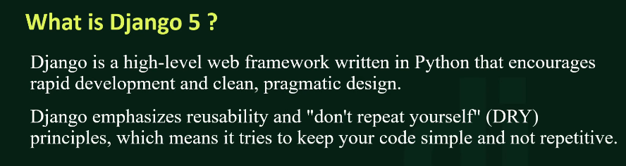

# Introduction to Django:-



It follows MVT architecture(Model View Template)


## Features and Advantage:-

- Built in Admin Interface
- ORM
- Authentication System
- Versality
- Security

# Django Prerequistie

- python 3.10 or Higher
- PIP
- Text Editor
- Web Browser

# How to Insstall Django????

- why use virtual Environment
  - Well the packages and libraries used in the project most of the times needed to be kept separate. With Venv we can keep them separated

---

Installation process:-
```cmd
python -m venv <Virtual env name>
```
Activation Process:-

```cmd
source ./<venv name>/bin/activate
```

and only then  You should download django

```cmd
pip install django
```

To check The downloaded libraries(only in python)
```cmd
pip freeze
```


# How to create django project:-

A django project may contain multiple project application, Which means a group of application and files is called as Django Project.
An application is a part of Django Project.


## How to start a project

```cmd
djang-admin startproject projectname
```

# Directory Structure:-
```
projectname/               ← Outer Project Directory
│
├── manage.py              ← Command-line utility for project management
│
└── projectname/           ← Inner Project Directory (same name as project)
    ├── __init__.py        ← Initializes this directory as a Python package
    ├── settings.py        ← Main configuration file
    │                        - Hosts, security settings, debug mode
    │                        - Installed apps
    │                        - Middleware
    │                        - Template and static directory settings
    ├── urls.py            ← Declares root-level URL routes
    ├── wsgi.py            ← WSGI entry point (for production servers)
    └── asgi.py            ← ASGI entry point (for async features)
```

