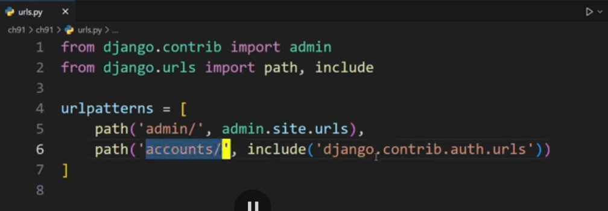
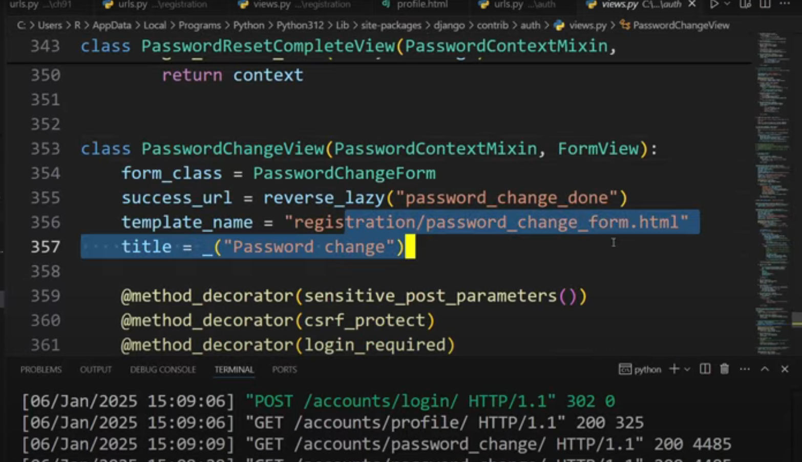
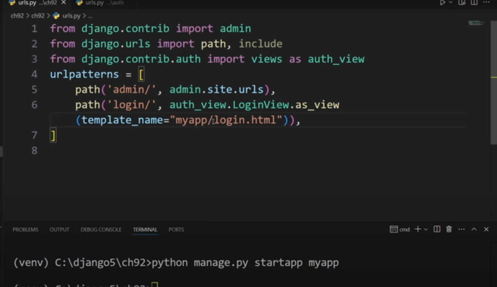
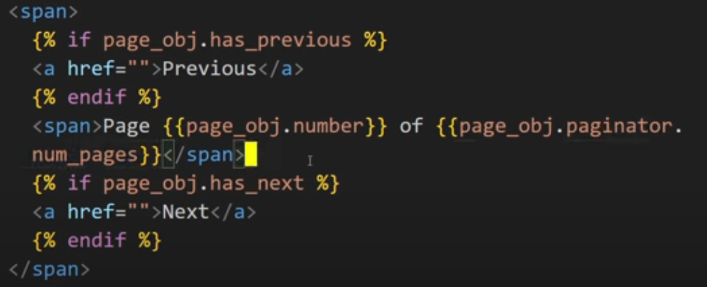

# Mixins
Mixins are reusable pieces of code that can be included in multiple classes. They allow for code reuse and can help keep your codebase DRY (Don't Repeat Yourself).

They are used mainly for restricting the inheritance of classes, allowing you to include functionality without needing to inherit from a base class.
it also let's you access the methods and properties of the mixin in the class that includes it.

```python
# mixins.py
from django.contrib.auth.mixins import UserPassesTestMixin
from django.http import HttpResponseForbidden
from django.shortcuts import redirect

class CustomUserPassesTestMixin(UserPassesTestMixin):
    """
    A custom mixin that checks if the user is authenticated and has a specific attribute.
    If not, it redirects to a 'not allowed' page.
    """
    # main function that checks the condition
    def test_func(self):
        return self.request.user.is_authenticated and hasattr(self.request.user, 'custom_attribute') and self.request.user.custom_attribute == 'value'
    

    def handle_no_permission(self):
        if self.request.user.is_authenticated:
            return HttpResponseForbidden("You do not have permission to access this page.")
        return redirect('login')
```
```python
# views.py
from django.views.generic import TemplateView
from .mixins import CustomUserPassesTestMixin

class MyView(CustomUserPassesTestMixin, TemplateView):
    template_name = 'my_template.html'
```

# Decorators in Class-Based Views(CBVs)
Decorators can also be used with class-based views to add functionality or restrict access. They can be applied to methods within the class or to the class itself.
Here's an example of using a decorator with a class-based view:
```python
# views.py
from django.contrib.auth.decorators import login_required
from django.utils.decorators import method_decorator

## If you don't want to write dispatch method, you can use the decorator directly on the class
# @method_decorator(login_required, name='dispatch')
class MyClassBasedView(TemplateView):
    template_name = 'my_template.html'
    # To apply the decorator to the entire class, use dispach method
    # This will ensure that the login_required decorator is applied to all HTTP methods (GET, POST, etc.)
    @method_decorator(login_required)
    def dispatch(self, *args, **kwargs):
        return super().dispatch(*args, **kwargs)
# Using the decorator on a specific method
    @method_decorator(login_required)
    def get(self, request, *args, **kwargs):
        return super().get(request, *args, **kwargs)
```
# Built-in Authentication
> have to make an app named `accounts` and add it to the `INSTALLED_APPS` in settings.py
> also have to make templates folder in the app and create a `registration` folder inside it, then create a `login.html` file inside the `registration` folder.
> To see all the built-in authentication views, you can run the command `python manage.py show_urls` after adding the `django.contrib.auth` app to your `INSTALLED_APPS`.



> as u can see the built-in authentication views are in the virtual environment, so you can use them directly in your project. to change the templates of these views, you can create a folder named `registration` in your templates folder and create the corresponding HTML files for each view.

> If we want to still customize the whole thing(not the logic part) but the templates part


# Async class-based views
Django supports asynchronous class-based views, allowing you to write views that can handle requests asynchronously.
To use them the whole process is same as the normal class-based views, just declare the functions as async functions using the `async def` syntax.
```python
# views.py
from django.http import JsonResponse
from django.views import View

class MyAsyncView(View):
    async def get(self, request, *args, **kwargs):
        # Your async logic here
        data = {'message': 'This is an async response'}
        return JsonResponse(data)
```
but if you declare one method as async, you have to declare all the methods as async in the class.

# Namespaces in Django
so there might be a case where you want to use the same name for different views, in that case you can use namespaces to differentiate between them.
To use namespaces, you can define them in your `urls.py` file. Here's an example
```python
# urls.py
from django.urls import path, include
from . import views

app_name = 'my_app'

urlpatterns = [
    path('', views.MyView.as_view(), name='my_view'),
    path('another/', views.AnotherView.as_view(), name='another_view'),
]
```
```python
# views.py
from django.views.generic import TemplateView
from django.urls import redirect
class MyView(TemplateView):
    template_name = 'my_app/my_template.html'

class AnotherView(TemplateView):
    template_name = 'my_app/another_template.html'

def redirect_to_my_view(request):
    return redirect('my_app:my_view')  # Use the namespace to redirect to the view
```

# Annotations in Django
Annotations in Django allow you to add additional data to your querysets. This can be useful for performing calculations or aggregations on your data without having to write raw SQL queries.
You can use the `annotate()` method on a queryset to add annotations. Here's an example:
```python
# models.py
from django.db import models

class Author(models.Model):
    name = models.CharField(max_length=100)

    def __str__(self):
        return self.name

class Book(models.Model):
    title = models.CharField(max_length=100)
    price = models.DecimalField(max_digits=5, decimal_places=2)
    author = models.ForeignKey(Author, on_delete=models.CASCADE, related_name='books')

    def __str__(self):
        return self.title
```
```python
# views.py
from django.shortcuts import render
from .models import Book

def book_list(request):
    books = Book.objects.annotate(discounted_price=F('price') * 0.8)
    return render(request, 'book_list.html', {'books': books})
def author_book_count(request):
    from django.db.models import Count
    authors = Author.objects.annotate(book_count=Count('books'))
    return render(request, 'author_book_count.html', {'authors': authors})
def author_book_price(request):
    from django.db.models import Sum
    authors = Author.objects.annotate(total_price=Sum('books__price'))
    return render(request, 'author_book_price.html', {'authors': authors})
``` 

# Select Related and Prefetch Related
`select_related` and `prefetch_related` are methods used to optimize database queries in Django. They help reduce the number of queries made to the database when accessing related objects.

- `select_related`: This method is used for single-valued relationships (ForeignKey and OneToOneField). It performs a SQL join and retrieves related objects in a single query. It is useful when the relation is one-to-one or many-to-one.

    ```python
    # models.py
    from django.db import models

    class Author(models.Model):
        name = models.CharField(max_length=100)

        def __str__(self):
            return self.name

    class Book(models.Model):
        title = models.CharField(max_length=100)
        price = models.DecimalField(max_digits=5, decimal_places=2)
        author = models.ForeignKey(Author, on_delete=models.CASCADE, related_name='books')

        def __str__(self):
            return self.title
    ```
    ```python
    # views.py
    from django.shortcuts import render
    from .models import Book

    def book_list(request):
        books = Book.objects.select_related('author').all()
        return render(request, 'book_list.html', {'books': books})
    ```
    > In normal cases the sql query is like this
    ```sql
    SELECT * FROM book;
    SELECT * FROM author WHERE id IN (1, 2, 3, ...);
    ```
    > But with `select_related`, it becomes:
    ```sql
    SELECT book.*, author.* FROM book INNER JOIN author ON book.author_id = author.id;
    ```
- `prefetch_related`: This method is used for multi-valued relationships (ManyToManyField and reverse ForeignKey). It performs a separate query for the related objects and does the joining in Python. It is useful when the relation is many-to-many or one-to-many.

    ```python
    # models.py
    from django.db import models
    class Teacher(models.Model):
        name = models.CharField(max_length=100)

        def __str__(self):
            return self.name

    class Student(models.Model):
        name = models.CharField(max_length=100)
        teachers = models.ManyToManyField(Teacher, related_name='students')

        def __str__(self):
            return self.name
    ```
    ```python
    # views.py
    from django.shortcuts import render
    from .models import Student

    def student_list(request):
        students = Student.objects.prefetch_related('teachers')
        return render(request, 'student_list.html', {'students': students})
    ```
    > In normal cases the sql query is like this
    ```sql
    SELECT * FROM student;
    SELECT * FROM teacher WHERE id IN (1, 2, 3, ...);
    ```
    > But with `prefetch_related`, it becomes:
    ```sql
    SELECT * FROM student;
    SELECT * FROM teacher WHERE id IN (1, 2, 3, ...);
    SELECT student_teachers.teacher_id FROM student_teachers WHERE student_teachers.student_id IN (1, 2, 3, ...);
    ```

# Pagination
Pagination is a way to split large datasets into smaller, manageable chunks. Django provides built-in support for pagination through the `Paginator` class.
Here's an example of how to use pagination in Django:
```python
# views.py
from django.core.paginator import Paginator
from django.shortcuts import render
from .models import Book

def book_list(request):
    books = Book.objects.all().order_by('title')  # Order by is mandatory for pagination
    paginator = Paginator(books, 10)  # Show 10 books per page
    page_number = request.GET.get('page')
    page_obj = paginator.get_page(page_number)
    return render(request, 'book_list.html', {'page_obj': page_obj})
```
```html
<!-- book_list.html -->

    <p>{{ book.title }} - {{ book.author.name }}</p>

<div class="pagination">
    <span class="step-links">
        
            <a href="?page=1">&laquo; first</a>
            <a href="?page={{ page_obj.previous_page_number }}">previous</a>
        
        <span class="current">
            Page {{ page_obj.number }} of {{ page_obj.paginator.num_pages }}.
        </span>
        
            <a href="?page={{ page_obj.next_page_number }}">next</a>
            <a href="?page={{ page_obj.paginator.num_pages }}">last &raquo;</a
        
    </span>
</div>
```



# Class-Based Views Pagination
Django's class-based views also support pagination. You can use the `ListView` class to handle pagination automatically.
Here's an example:
```python
# views.py
from django.views.generic import ListView
from .models import Book
class BookListView(ListView):
    model = Book
    template_name = 'book_list.html'
    context_object_name = 'books'
    paginate_by = 10  # Show 10 books per page
    def get_queryset(self):
        return Book.objects.all().order_by('title')  # Order by is mandatory for pagination
```
```html
<!-- book_list.html -->
 
    <p>{{ book.title }} - {{ book.author.name }}</p>

<div class="pagination">
    <span class="step-links">
        
            
                <a href="?page=1">&laquo; first</a>
                <a href="?page={{ page_obj.previous_page_number }}">previous</a>
            
            <span class="current">
                Page {{ page_obj.number }} of {{ page_obj.paginator.num_pages }}.
            </span>
            
                <a href="?page={{ page_obj.next_page_number }}">next</a>
                <a href="?page={{ page_obj.paginator.num_pages }}">last &raquo;</a
            
        
    </span>
</div>
```
# Logging in Django
Django provides a built-in logging framework that allows you to log messages from your application. You can configure logging in your `settings.py` file.
Here's an example of how to set up logging:
```python
# settings.py
import os
LOGGING = {
    'version': 1, # The version of the logging configuration schema
    'disable_existing_loggers': False, # Whether to disable existing loggers
    'formatters': {
        'standard': {
            'format': '{levelname} {name} {lineno} {asctime} {pathname} {module} {funcname} {filename} {message}',
            'style': '{',
            # 'format': '$levelname $name $lineno $asctime $pathname $module $funcname $filename $message',
            #'style': '$',
        },
        # 
        'simple': {
            'format': '{levelname} {lineno} {asctime} {filename} {message}',
            'style': '{',
        },
    },
    handlers = {
        'console': {
            'level': 'DEBUG',  # Set the logging level
            'class': 'logging.StreamHandler',  # Use StreamHandler to log to console
            'formatter': 'standard',  # Use the standard formatter
        },
        'file': {
            'level': 'ERROR',
            'class': 'logging.FileHandler',
            'filename': os.path.join(BASE_DIR, 'django.log'),  # Log to a file
            'formatter': 'standard',
        },
    },
    'loggers': {
        '': {
            'handlers': ['console', 'file'],
            'level': 'DEBUG',
            'propagate': False,
        },
        'app_name': {  # Replace 'app_name' with your app's name
            'handlers': ['console', 'file'],
            'level': 'DEBUG',
            'propagate': True,  # Propagate messages to the root logger
        },
    }
}
```
You can then use the logging module in your views or other parts of your application:
```python
# views.py
import logging


def my_view(request):
    logger = logging.getLogger(__name__)
    logger.debug("This is a debug message")
    logger.info("This is an info message")
    logger.warning("This is a warning message")
    logger.error("This is an error message")
    logger.critical("This is a critical message")
    return render(request, 'my_template.html')
```
Now this log file will eventually become large, so you can use the `RotatingFileHandler`, `timed rotating file handler`, or `watchdog` to manage the log file size and rotation.

```python
# settings.py
from logging.handlers import RotatingFileHandler, TimedRotatingFileHandler

LOGGING = {
    'version': 1,
    'disable_existing_loggers': False,
    'formatters': {
        'standard': {
            'format': (
                '{levelname} {name} {lineno} {asctime} '
                '{pathname} {module} {funcName} {filename} {message}'
            ),
            'style': '{',
        },
        'simple': {
            'format': '{levelname} {lineno} {asctime} {filename} {message}',
            'style': '{',
        },
    },
    'handlers': {
        'console': {
            'level': 'DEBUG',
            'class': 'logging.StreamHandler',
            'formatter': 'standard',
        },
        'file': {
            'level': 'ERROR',
            'class': 'logging.FileHandler',
            'filename': os.path.join(BASE_DIR, 'django.log'),
            'formatter': 'standard',
        },
        'rotating_file': {
            'level': 'DEBUG',
            'class': 'logging.handlers.RotatingFileHandler',
            'filename': os.path.join(BASE_DIR, 'django.log'),
            'maxBytes': 5 * 1024 * 1024,  # 5 MB
            'backupCount': 5,
            'formatter': 'standard',
        },
        'timed_rotating_file': {
            'level': 'DEBUG',
            'class': 'logging.handlers.TimedRotatingFileHandler',
            'filename': os.path.join(BASE_DIR, 'django_timed.log'),
            'when': 'midnight',
            'backupCount': 7,
            'formatter': 'standard',
        },
    },
    'loggers': {
        # catch‑all logger
        '': {
            'handlers': ['console', 'rotating_file'],
            'level': 'DEBUG',
            'propagate': False,
        },
        # your app logger
        'app_name': {
            'handlers': ['console', 'timed_rotating_file'],
            'level': 'DEBUG',
            'propagate': True,
        },
    },
}
```