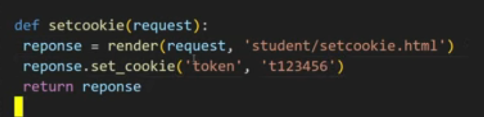
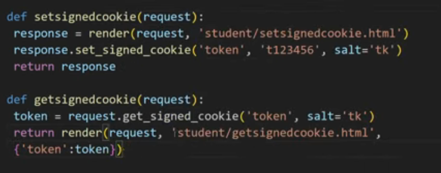

# Day 6 Django Project

## Overview
This project demonstrates user authentication and account management features using Django. Tailwind CSS is used for modern UI styling.

## Features Implemented
- User registration
- User login/logout
- Password reset and change functionality
- Authentication-based navigation (shows different menu items for logged-in/out users)
- Responsive layout using Tailwind CSS
- Organized Django app structure (`account` app)
- Custom base template for consistent site layout

## File Structure
- `account/` app: Handles user-related logic (models, views, forms, templates)
- `templates/base.html`: Main site template with navigation and content blocks
- `day6/settings.py`: Django settings for the project
- `manage.py`: Django management script
- `db.sqlite3`: SQLite database

## How to Run
1. Install dependencies from `requirements.txt`
2. Run migrations: `python manage.py migrate`
3. Start the server: `python manage.py runserver`

## Notes
- Navigation adapts based on authentication status
- Password management (reset/change) is available
- Tailwind CSS is loaded via CDN for styling

## Custom User Model & Manager
- Created a custom `User` model inheriting from `AbstractBaseUser` with fields for email, first/last name, and flags for staff/superuser/seller/customer.
- Implemented a custom `UserManager` to handle user and superuser creation, enforcing email uniqueness and password hashing.

## Authentication Processes
- **Registration:**
  - Used a custom `RegistrationForm` to collect user info and passwords.
  - On registration, user is created inactive and sent an activation email with a tokenized link.
- **Login:**
  - Used a custom `LoginForm` to validate credentials and authenticate users by email/password.
- **Change Password:**
  - Used a custom `ChangePasswordForm` to verify old password and set a new one.
- **Forgot Password:**
  - User submits email, receives a reset link with a token via email if the account exists.

## Email Activation & Password Reset
- Used Django's `urlsafe_base64_encode`/`decode` and `default_token_generator` to securely generate and verify activation/reset tokens.
- Sent emails asynchronously using a custom `send_async_email` utility (threaded, uses Django's `send_mail`).
- Activation and reset links include encoded user ID and token, which are decoded and verified in the respective views.

## Security & Decryption
- User ID is encoded with `urlsafe_base64_encode` and decoded with `urlsafe_base64_decode`.
- Token is generated and checked using Django's built-in token generator for secure activation/reset.
- All password changes and resets use Django's password hashing.

## Templates & Navigation
- Navigation adapts based on authentication status (login/register/forgot password for guests, change password/logout for users).
- All forms and flows are handled with custom templates for a clean UI.

## Example Code Snippets

### Custom User Model & Manager
```python
# models.py
from django.db import models
from django.contrib.auth.models import AbstractBaseUser, BaseUserManager

class UserManager(BaseUserManager):
    def create_user(self, email, password=None):
        if not email:
            raise ValueError('The Email field must be set')
        user = self.model(email=self.normalize_email(email))
        user.set_password(password)
        user.save(using=self._db)
        return user

    def create_superuser(self, email, password=None, **extra_fields):
        extra_fields.setdefault('is_staff', True)
        extra_fields.setdefault('is_superuser', True)
        user = self.create_user(email, password)
        user.is_staff = True
        user.is_superuser = True
        user.save(using=self._db)
        return user

class User(AbstractBaseUser):
    email = models.EmailField(unique=True)
    first_name = models.CharField(max_length=30, blank=True)
    last_name = models.CharField(max_length=30, blank=True)
    is_active = models.BooleanField(default=False)
    is_staff = models.BooleanField(default=False)
    is_superuser = models.BooleanField(default=False)
    objects = UserManager()
    USERNAME_FIELD = 'email'
```

### Registration & Activation
```python
# views.py
from django.utils.http import urlsafe_base64_encode, urlsafe_base64_decode
from django.utils.encoding import force_bytes, force_str
from django.contrib.auth.tokens import default_token_generator
from django.urls import reverse
from .utils import send_async_email

def register(request):
    # ...
    user = form.save(commit=False)
    user.set_password(form.cleaned_data['password1'])
    user.save()
    uidb64 = urlsafe_base64_encode(force_bytes(user.pk))
    token = default_token_generator.make_token(user)
    activation_link = reverse('activate', kwargs={'uidb64': uidb64, 'token': token})
    activation_url = f'{settings.SITE_DOMAIN}{activation_link}'
    send_async_email('Activate Your Account', f'Click: {activation_url}', user.email)
```

### Login
```python
# views.py
def login(request):
    # ...
    user = authenticate(email=email, password=password)
    if user is not None:
        auth_login(request, user)
        return redirect('home')
```

### Change Password
```python
# forms.py
class ChangePasswordForm(forms.Form):
    old_password = forms.CharField(widget=forms.PasswordInput)
    new_password1 = forms.CharField(widget=forms.PasswordInput)
    new_password2 = forms.CharField(widget=forms.PasswordInput)
    # ...
    def save(self, commit=True):
        self.user.set_password(self.cleaned_data['new_password1'])
        if commit:
            self.user.save()
        return self.user
```

### Forgot Password & Reset
```python
# views.py
def forgot_password(request):
    # ...
    user = User.objects.get(email=email)
    uidb64 = urlsafe_base64_encode(force_bytes(user.pk))
    token = default_token_generator.make_token(user)
    reset_link = reverse('reset_password', kwargs={'uidb64': uidb64, 'token': token})
    reset_url = f'{settings.SITE_DOMAIN}{reset_link}'
    send_async_email('Reset Your Password', f'Click: {reset_url}', user.email)
```

### Email Utility
```python
# utils.py
import threading
from django.core.mail import send_mail

def send_async_email(subject, message, to_email):
    threading.Thread(target=send_mail, args=(subject, message, None, [to_email])).start()
```

### Token Decryption
```python
# views.py
def activate(request, uidb64, token):
    uid = force_str(urlsafe_base64_decode(uidb64))
    user = User.objects.get(pk=uid)
    if default_token_generator.check_token(user, token):
        user.is_active = True
        user.save()
```

### Custom Permission

decoretors.py

```python
from django.contrib.auth.decorators import login_required
from functools import wraps
from django.http import HttpResponseForbidden


def login_required_custom(required_role):
    """Decorator to enforce login and role-based access control.
    Usage: @login_required_custom('customer') or @login_required_custom('seller')
    """
    def decorator(view_func):
        @login_required
        @wraps(view_func)
        def _wrapped_view(request, *args, **kwargs):
            user = request.user
            if required_role =="customer" and not user.is_customer:
                return HttpResponseForbidden("You do not have permission to access this page.")
            if required_role == "seller" and not user.is_seller:
                return HttpResponseForbidden("You do not have permission to access this page.")
            return view_func(request, *args, **kwargs)
        return _wrapped_view
```

### add Permissions to user


permissions.py

```python
from products.models import Product

PERMISSION_CONFIG = {
    'customer': {
        Product:["view"]
    },
    'seller': {
        Product:["view","add","change"]
    },
}
```

utils.py

```python
from django.contrib.auth.models import Permission
from django.contrib.contenttypes.models import ContentType
from products.models import Product

def assign_permissions(user, role):
    """Assign permissions to user based on their role."""
    content_type = ContentType.objects.get_for_model(Product)
    permissions = PERMISSION_CONFIG.get(role, {})
    
    for model, perms in permissions.items():
        for perm in perms:
            permission = Permission.objects.get(
                codename=f"{perm}_{model._meta.model_name}",
                content_type=content_type
            )
            user.user_permissions.add(permission)
```
```python
# views.py
from django.shortcuts import render, redirect
from django.contrib.auth.decorators import login_required
from .permissions import assign_permissions
from .models import User

def register(request):
    if request.method == 'POST':
        form = RegistrationForm(request.POST)
        if form.is_valid():
            user = form.save()
            role = form.cleaned_data['role']
            assign_permissions(user, role)  # Assign permissions based on role
            return redirect('login')
    else:
        form = RegistrationForm()
    return render(request, 'account/register.html', {'form': form})
```

```python
@login_required
def product_list(request):
    if request.user.has_perm('products.view_product'):
        products = Product.objects.all()
        return render(request, 'products/product_list.html', {'products': products})
    return HttpResponseForbidden("You do not have permission to view products.")
```


### COOKIE

A cookie is a small piece of data stored on the user's computer by a server. It’s used to remember information about the user across multiple requests or visits to the site.

we send it like this-> 

set-> 
get-> 
delete-> 

More secure->
signed cookies are more secure because they include a signature that verifies the integrity of the cookie data. This prevents tampering, as any changes to the cookie would invalidate the signature.




## Session Management
Django uses sessions to store data on the server side, allowing you to keep track of user interactions across requests. Sessions are typically stored in the database, cache, or file system.

> important settings.py
```python
# settings.py
INSTALLED_APPS = [
    ...
    'django.contrib.sessions',
    ...
]
MIDDLEWARE = [
    ...
    'django.contrib.sessions.middleware.SessionMiddleware',
    ...
]
```

SET->
get->
delete->
flush-> (used for clearing all session data/logout)

## Session Security
To enhance session security, you can configure settings like `SESSION_COOKIE_SECURE`, `SESSION_EXPIRE_AT_BROWSER_CLOSE`, and `SESSION_COOKIE_AGE` in your `settings.py` file. These settings help protect against session hijacking and ensure that sessions are only valid over secure connections.

```python
# settings.py
SESSION_COOKIE_SECURE = True  # Use secure cookies (HTTPS only)
SESSION_EXPIRE_AT_BROWSER_CLOSE = True  # Expire session when browser closes
SESSION_COOKIE_AGE = 1209600  # Session duration in seconds (2 weeks)
```

## Session in Files
Django can store session data in files by configuring the session engine in `settings.py`. This is useful for lightweight applications or when you want to avoid database overhead.
```python
# settings.py
SESSION_ENGINE = 'django.contrib.sessions.backends.file'
SESSION_FILE_PATH = BASE_DIR /'sessions'  # Specify the directory for session files
```
This will create session files in the specified directory, allowing you to manage session data without a database.


## Cache Management
Django provides a caching framework to store frequently accessed data in memory, reducing database queries and improving performance. You can use various backends like Memcached, Redis, or the local memory cache.
It helps in speeding up the application by storing data that is expensive to compute or retrieve.
### ✅ Django’s Caching Types :-

1. #### **Per-Site Caching** ✅

   * Caches **every page** for every user across the whole site.
   * Enabled via Django middleware (`UpdateCacheMiddleware` and `FetchFromCacheMiddleware`).
   * Good for public sites where the content is mostly static.
   * **Set in `settings.py`:**

    ```python
    MIDDLEWARE = [
        'django.middleware.cache.UpdateCacheMiddleware',
        ...
        'django.middleware.cache.FetchFromCacheMiddleware',
    ]

     

    CACHES = {
        'default': {
            'BACKEND': 'django.core.cache.backends.db.DatabaseCache',
            'LOCATION': 'django_cache',
            'TIMEOUT': 60 * 5,  # cache for 5 minutes
            'OPTIONS': {
                'MAX_ENTRIES': 1000,  # maximum number of entries in cache
            },
        }
    }
    # Local memory cache
    CACHES = {
        'default': {
            'BACKEND': 'django.core.cache.backends.locmem.LocMemCache',
            'LOCATION': 'unique-snowflake',
            'TIMEOUT': 60 * 5,  # cache for 5 minutes
        }
    }

    CACHE_MIDDLEWARE_SECONDS = 600  # cache for 10 minutes
    ```
    ```console
    python manage.py createcachetable  # create cache table in database
    ```


#### 2. **Per-View Caching**

- Caches the **entire output of a specific view**.
- More flexible than per-site caching.
- No middleware needed.
- Uses the `@cache_page` decorator.
- There are two ways to use it:

  **a. In the view function:**

  ```python
  from django.views.decorators.cache import cache_page

  @cache_page(60 * 5)
  def my_view(request):
      ...


**b. In the URL configuration:**

```python
# urls.py
from django.urls import path
from .views import my_view
from django.views.decorators.cache import cache_page

urlpatterns = [
    path('my-view/', cache_page(60 * 5)(my_view), name='my_view'),
]
```


3. #### **Template Fragment Caching**

   * Caches **sections of templates**.
   * Useful when only parts of a page are slow.
   * Syntax:

     ```django
     
     
         ... expensive HTML block ...
     
     ```

4. #### **Low-Level Caching**

   * Caches **arbitrary Python data** (querysets, computations, etc.)
   * Uses the `django.core.cache` API:

     ```python
     from django.core.cache import cache

     result = cache.get("expensive_query")
     if result is None:
         result = do_expensive_thing()
         cache.set("expensive_query", result, timeout=300)
     cache.add("new_key", "value", timeout=300)  # Adds only if key doesn't exist
     cache.delete("old_key")  # Deletes a key from cache
     cache.clear()  # Clears the entire cache
     cache.set_many({"key1": "value1", "key2": "value2"}, timeout=300)  # Set multiple keys at once
     cache.get_many(["key1", "key2"])  # Get multiple keys at once
     cache.touch("key", timeout=600)  # Update timeout of an existing key
     cache.incr("counter")  # Increment a numeric value in cache
     cache.decr("counter")  # Decrement a numeric value in cache
     ```

---

### ✅ Final Summary

| Type                  | Scope                   | Example Use Case                       |
| --------------------- | ----------------------- | -------------------------------------- |
| **Per-Site Caching**  | Entire site (all pages) | Blog or CMS with same content for all  |
| **Per-View Caching**  | One view function/class | Product listing or home page           |
| **Template Fragment** | Part of a template      | Sidebar, footer, or tag cloud          |
| **Low-Level Caching** | Arbitrary data          | Querysets, computations, external APIs |

---

It has 3 places to store cache:
1. **Database**: Stores cache data in the database tables.
   - Use `django.core.cache.backends.db.DatabaseCache`.
   - Requires `django.contrib.sessions` app.
   - Create cache table with `python manage.py createcachetable`.
2. **File System**: Stores cache data in files on the server.
   - Use `django.core.cache.backends.filebased.FileBasedCache`.
   - Specify directory in `settings.py` with `FILE_CACHE_DIR`.
3. **Memory**: Stores cache data in memory (RAM).
   - Use `django.core.cache.backends.locmem.LocMemCache`.
   - Fastest but data is lost on server restart.

